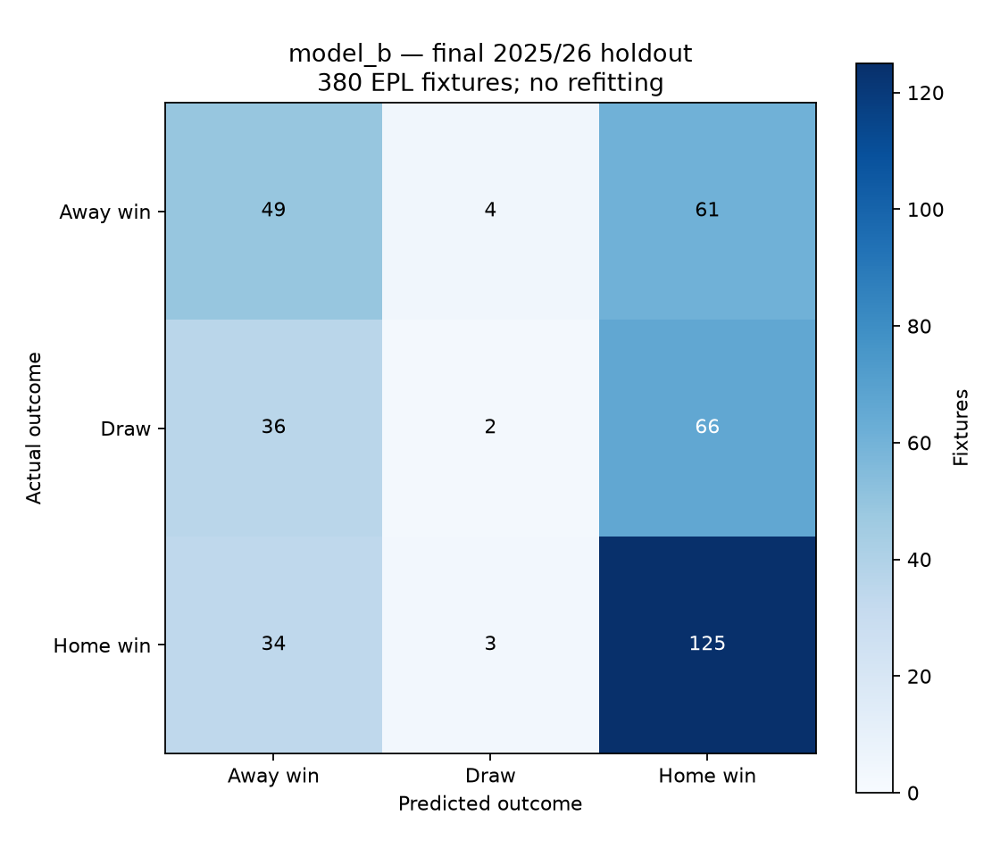
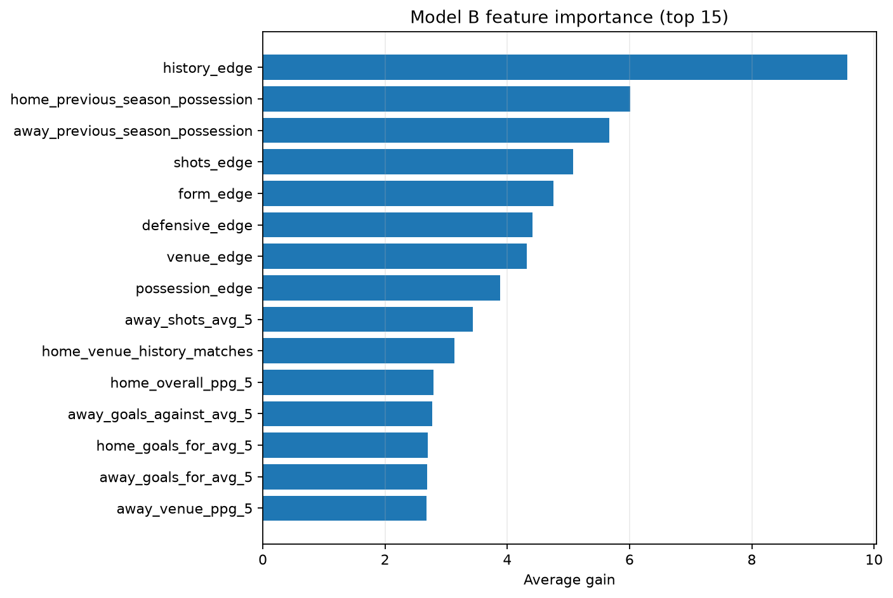

# EPL Match Outcome Predictor

An **English Premier League-only** Python project that estimates away-win, draw,
and home-win probabilities from information available before kickoff. It
demonstrates chronological feature engineering, leakage tests, a controlled
possession experiment, and a frozen XGBoost prediction command.

Phases 0–11 are complete; Phase 12 (the final portfolio quality gate) is not yet
started. This is an offline research snapshot, not a live service or betting
recommendation. Stored matches end on **2026-05-24**.

## Start here

- [Reproduction guide](docs/REPRODUCIBILITY.md): setup, clean-clone restoration,
  historical pipeline commands, and troubleshooting.
- [Data dictionary](docs/DATA_DICTIONARY.md): schemas, feature order, missingness,
  units, labels, and provenance.
- [Sample prediction](docs/sample_prediction.json): actual output for an
  illustrative Arsenal–Chelsea request, including stale-data warnings.
- [Engineering specification](EPL_MATCH_OUTCOME_PREDICTOR_SPEC.md): fixed
  contracts, selection rules, and phase boundaries.

A fresh clone contains the data and reports but **not the nine model JSON
artifacts**, which remain intentionally ignored. Obtain a checksum-verified
frozen-model bundle from the project owner before attempting inference.
[The guide](docs/REPRODUCIBILITY.md) explains how to export and restore it.
There is no public artifact release supplied by this repository; a code-only
clone cannot reproduce frozen predictions by itself.

## Setup and quick use

Use Git and **Python 3.12** for the tested locked environment. The application
specification permits Python 3.11+, but this dependency lock was validated on
Python 3.12, not every supported interpreter or operating system.

Windows PowerShell, from the project root:

```powershell
py -3.12 -m venv .venv/runtime
.\.venv\runtime\Scripts\Activate.ps1
python -m pip install -r requirements.lock.txt
python -m pip check
```

macOS/Linux equivalent (not exercised in the Windows validation):

```bash
python3.12 -m venv .venv/runtime
source .venv/runtime/bin/activate
python -m pip install -r requirements.lock.txt
python -m pip check
```

Use an installed Python 3.12 executable if the launcher command is unavailable.
The nested environment leaves an older `.venv` intact. Phase 11 validation used
this replacement environment; it is not included in Git. If PowerShell activation is
restricted, invoke `.\.venv\runtime\Scripts\python.exe` directly; no execution-policy
change is necessary.

Once the frozen artifacts have been restored:

```bash
python -m src.freeze_model --verify
python -m src.predict --home "Arsenal" --away "Chelsea" --date 2026-09-12
python -m src.evaluate --model-name selected --split holdout --frozen
```

The example is a user-supplied hypothetical fixture, **not a verified schedule**.
Prediction returns one JSON object and writes no files. The holdout command now
verifies and returns saved results; it does not repeat holdout inference.

## Architecture

```text
Immutable EPL CSVs -> canonical fixtures -> two team-history rows per fixture
                                      -> strictly prior rolling features
SofaScore team-season averages        -> previous-season possession join
                                      -> fixed chronological splits
                                      -> training-only medians + XGBoost
                                      -> frozen artifacts -> JSON prediction
```

There is one model row per fixture, oriented toward the home team. Labels are
away win = 0, draw = 1, home win = 2. Rolling windows use the last five completed
EPL matches, with at least three observations, excluding the current date.
Windows carry across EPL seasons. Separate home/away venue histories represent
home advantage; missing values use medians fitted on training data only.

Model A uses 22 non-possession features and the longer training history.
Model A-Matched uses those same features on the possession-eligible cohort.
Model B adds three columns: home and away previous-season possession and their
difference. Only A-Matched versus B isolates the incremental possession signal.

| Split | Seasons | Model A fixtures | Matched A / B fixtures |
|---|---|---:|---:|
| Training | 2010/11–2022/23; matched begins 2018/19 | 4940 | 1900 |
| Validation | 2023/24 | 380 | 380 |
| Test | 2024/25 | 380 | 380 |
| Final holdout | 2025/26 | 380 | 380 |

Validation controls the seven-candidate bounded search and early stopping.
Test data selects the final candidate under the predeclared log-loss/F1 rules.
The holdout was evaluated once only after the model-selection freeze.

## Data sources and request limits

Football-Data supplies 6,080 EPL fixtures across 2010/11–2025/26, identified by
division `E0`. SofaScore supplies 180 team-season possession rows across
2017/18–2025/26: 20 clubs per season, each with 38 recorded matches. Provider
URLs, retrieval metadata and exact checksums are retained in
`data/raw/manifest.json` and the possession export.

The SofaScore endpoints returned HTTP 403 during collection, so this snapshot
uses the manifested export of the same website statistics. No live request is
needed to use the existing data. Do not interpret that historical failure as a
claim about current service availability.

A final average for season N can only enter fixtures in N+1. Thus 2025/26
holdout features use 2024/25 possession, while a 2026/27 prediction can use
2025/26 possession. Match-level possession is not required.

SofaScore needs no key in this implementation. Its `--max-requests` setting is
a **local request budget**, not a promised free-tier allowance. Attempts and
fallback-host requests consume the budget; valid caches/export rows do not.
HTTP 429 honors a numeric Retry-After with a minimum two-second wait; other
transient failures use bounded retries, and 403/404 advances to the configured
fallback host. Budget exhaustion preserves completed caches for a later resume.

The retained API-Football collector is a **legacy, unused alternative**. It
requires a key, stops at its local budget or an observed zero remaining quota,
and stops on HTTP 429/quota errors. There is no automatic daily wake-up or
hard-coded promise of an account's free-plan quota. Never commit credentials
or substitute that collector's data into this frozen run.

## Results and model decision

Saved 2024/25 test results (380 identical test fixtures; lower log loss is better):

| Model | Log loss | Macro F1 | Accuracy |
|---|---:|---:|---:|
| majority_baseline | 1.082216 | 0.193146 | 0.407895 |
| logistic_regression | 1.033743 | 0.366356 | 0.489474 |
| model_a | 1.039492 | 0.348426 | 0.471053 |
| model_a_matched | 1.047621 | 0.330596 | 0.450000 |
| model_b | 1.031919 | 0.366448 | 0.471053 |

Model B improves matched-baseline log loss by 0.015702 and passes the 0.02
macro-F1-drop guardrail. It also has the lowest test log loss and highest macro
F1 among the three XGBoost selection candidates. Logistic regression remains
a strong benchmark and has higher test accuracy, but it is not in the fixed
Section 10.6 final-candidate set.

The advantage is modest and does not establish statistical significance or
causation. See the [possession experiment](reports/possession_experiment.md),
[pre-holdout selection decision](reports/model_selection.md), and
[complete metrics](reports/model_results.csv).

| Model B metric | 2024/25 test | 2025/26 final holdout |
|---|---:|---:|
| Log loss | 1.031919 | 1.075037 |
| Macro F1 | 0.366448 | 0.353288 |
| Accuracy | 47.11% | 46.32% |

Holdout log loss worsened by 4.18%; accuracy declined by 0.79 percentage
points. Only **2 of 104 draws** were correctly classified (1.92% draw recall).
Only Model B was evaluated on holdout: no holdout comparison or possession
uplift against other models is claimed. [Final report](reports/final_holdout.md).





Feature importance describes fitted-model gain, not the causal effect of
possession or any other feature on winning.

## Frozen state and limitations

- The original configuration, source data, feature definitions, medians,
  parameters, and holdout outputs remain unchanged. Model B uses saved best
  iteration 267, i.e. prediction iterations [0, 268).
- The Phase 8 configuration and Phase 9/10 extension protocols anchor the
  implementation to Git history. Do not use shallow/source-only exports for
  verification, rewrite these records, or delete holdout receipts to rerun it.
  The old metadata's `holdout_evaluated=false` describes its historical creation
  state; the final receipt records completion.
- This is a sequential pre-match backtest, not a simultaneous preseason forecast.
  Earlier completed matches in the same holdout season can update rolling features.
- Only EPL history is allowed. New or returning clubs can have missing or very
  old EPL history. Training medians and history counts handle missingness but
  cannot recreate information that is absent.
- For forecasts, histories older than 14 days produce warnings. The example
  uses a May 24 snapshot, 111 days before September 12. It is not live form.
- Dates on or before the latest source match are rejected. Upcoming date-only
  requests use July 1 as the season boundary; this is not a historical-season
  classifier for unusual schedules such as the delayed 2019/20 season.
- Unknown/noncanonical names, identical teams, and unsupported future seasons
  fail clearly. A requested season needs the complete preceding EPL season
  and its possession table meeting the frozen coverage threshold.
- The command does not verify scheduling or current league membership.
  `feature_as_of` is a match date; exact completion timestamps are unavailable.
- No injuries, lineups, player events, other leagues, bookmaker odds, or
  current-match results enter the feature vector. Probabilities are not a
  guarantee of performance or evidence of betting profitability.
- Changing the model after viewing holdout needs a new future holdout season.
  Nothing in the reproduction instructions authorizes retuning on 2025/26.

## Repository map

| Location | Purpose |
|---|---|
| `src/` | Data pipelines, frozen evaluation, and prediction |
| `config/` | Team mapping, season policy, model freeze, phase extension records |
| `data/raw/` | Immutable, manifested inputs (tracked CSV snapshot) |
| `data/processed/` | Canonical fixtures, history, features and split manifests |
| `models/` | Nine local/ignored frozen model, preprocessing and metadata files |
| `reports/` | Tracked metrics, charts, selection and one-time holdout audit |
| `tests/` | 147 frozen modeling, leakage, integrity and prediction tests |
| `scripts/` | Artifact transfer and documentation checks; no model changes |
| `docs/` | Data dictionary, reproduction guide and exact sample JSON |

## Validation

With the locked environment active and the model bundle restored:

```bash
python -m unittest discover -s tests -v
python -m unittest discover -s scripts/tests -v
python scripts/validate_docs.py
python -m src.freeze_model --verify
git status --short
```

Phase 11 validation and its tested scope are recorded in the
[reproduction guide](docs/REPRODUCIBILITY.md). Phase 12 requires a separate request.
